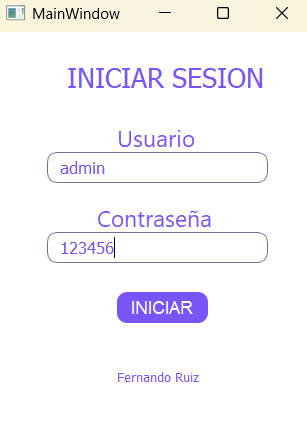
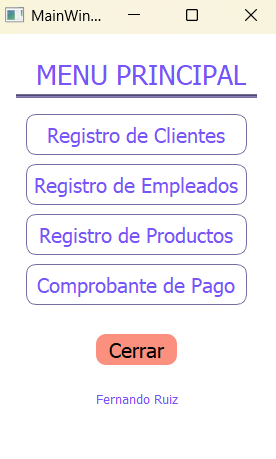
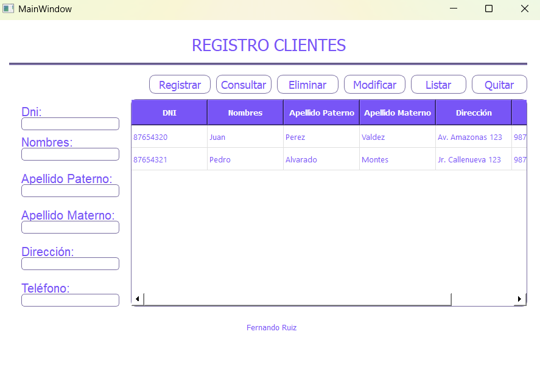
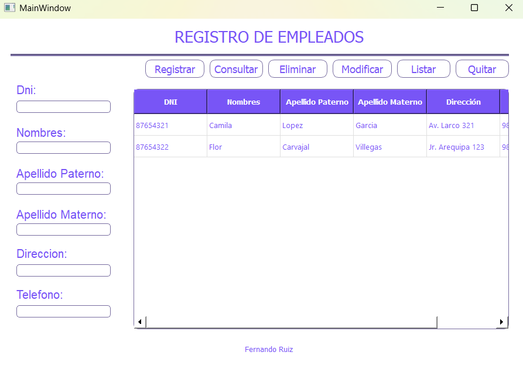
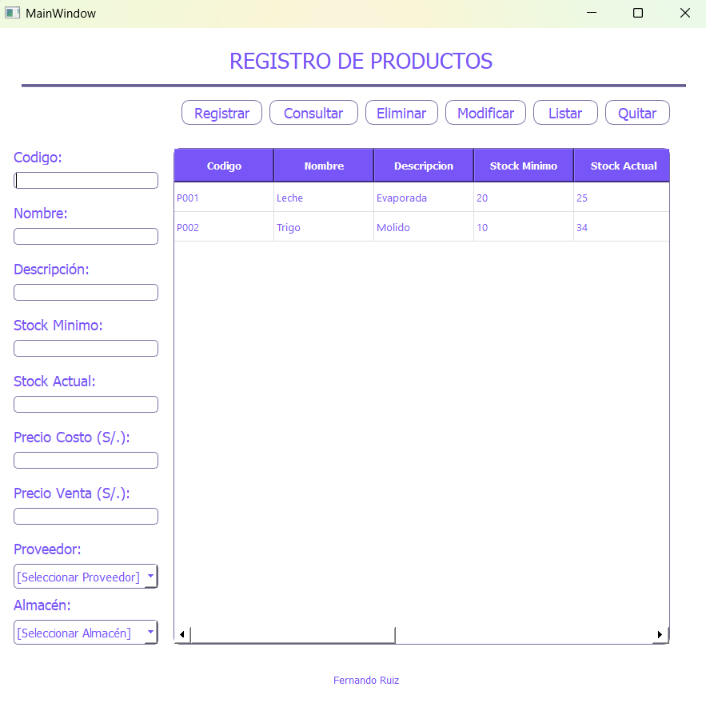
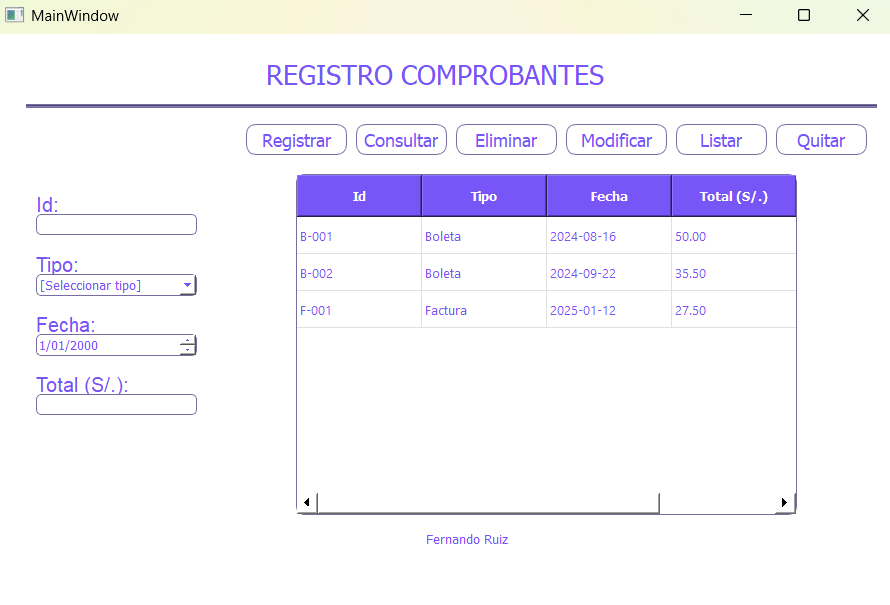

# Sistema de Gestión de Tienda

Este proyecto es un sistema de gestión de una tienda desarrollado en **Python**, que permite administrar de forma sencilla los principales elementos del negocio mediante una interfaz con ventanas.

El sistema está organizado en secciones accesibles desde una ventana principal, facilitando la navegación y el uso.

---
## Funcionalidades

El sistema cuenta con las siguientes opciones:

### Login (Inicio de Sesión)
- Login de acceso al programa (las credenciales son usuario: admin y contraseña: 123456).


### Ventana Principal
- Punto de acceso central a todas las funcionalidades del sistema.
- Permite navegar entre clientes, empleados, productos y comprobantes.



### Gestión de Clientes
- Registro de clientes.
- Actualización y eliminación de clientes.



### Gestión de Empleados
- Registro de empleados.
- Actualización y eliminación de empleados.



### Gestión de Productos
- Registro de productos.
- Control de precios y stock.
- Modificación y eliminación de productos.



### Gestión de Comprobantes
- Registro de comprobantes.
- Modificación y eliminación de comprobantes.



---
## Tecnologías Utilizadas

- Lenguaje: Python
- Arquitectura: MVC
- Base de datos: PostgreSQL
- Interfaz gráfica: PyQt, QT Designer

---

## Ejecución del Proyecto

1. Clona el repositorio:
   ```bash
   git clone https://github.com/tu-usuario/gestion-tienda-python.git
   ```

2. Accede al proyecto:
   ```bash
   cd python-store-management
   ```

3. Crea y activa un entorno virtual:
   ```bash
   python -m venv venv
   venv\Scripts\activate
   ```

4. Instala las dependencias:
   ```bash  
   pip install -r requirements.txt
   ```

5. Ejecuta la aplicación
   ```bash
   python main.py
   ```

---

## Configuración de la Base de Datos

Antes de ejecutar la aplicación, debes crear una base de datos en PostgreSQL.

Asegúrate de configurar las variables de entorno para la conexión a la base de datos.

   ```bash
   DB_HOST
   DB_DATABASE
   DB_USER
   DB_PASSWORD
   DB_PORT
   ```

## 👤 Autor

Fernando Ruiz

Este es un proyecto académico, el cual he ampliado y mejorado con fines educativos.
